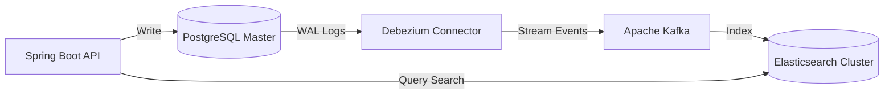
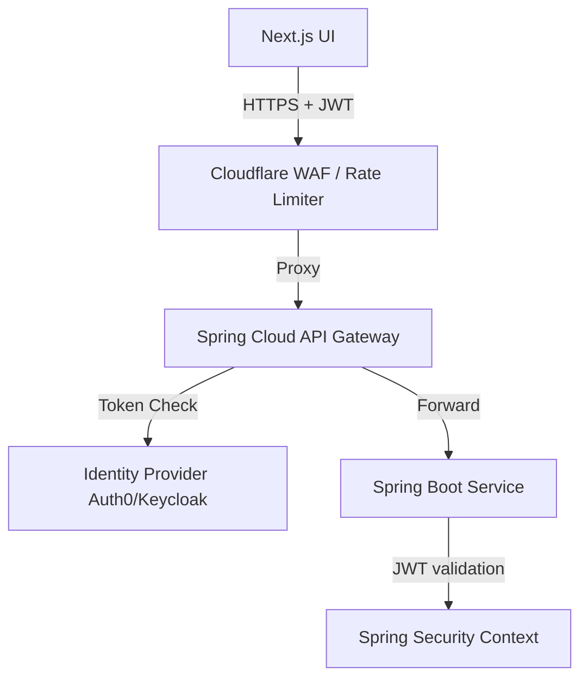

# RayFlow Architecture Design Document

This document outlines the architectural blueprints, scaling strategies, and security frameworks designed to transition the RayFlow Contracts Management System from a development environment to an enterprise-grade SaaS platform.

---

## 1. Scaling to Hundreds of Thousands of Contracts

As transaction volumes scale to hundreds of thousands of contracts, database I/O, locks, and connection thresholds become primary system bottlenecks. The following patterns address these scaling issues:

### 1.1 Database Read-Write Splitting (Command Query Responsibility Segregation)
Write transactions (contract creation, state updates) require strict locking policies. Read transactions (filtering, dashboard listing) can tolerate slight latency. We separate these concerns:

*   **Primary Database (Master):** Handles all write transactions.
*   **Read Replicas (Slaves):** Synchronized asynchronously via PostgreSQL streaming replication.
*   **Routing:** Spring Data's `AbstractRoutingDataSource` dynamically routes requests based on transaction contexts:
    *   `@Transactional` -> Primary DB.
    *   `@Transactional(readOnly = true)` -> Read Replicas.

```mermaid
graph TD
    App[Spring Boot Service] -->|@Transactional| Primary[PostgreSQL Master - Write]
    App -->|@Transactional(readOnly = true)| Replica[PostgreSQL Replica - Read]
    Primary -->|Streaming Replication| Replica
```

### 1.2 Database Partitioning (Horizontal Sharding)
To prevent index tree depths from growing too large, we implement PostgreSQL declarative partitioning.
*   **Time-Based Partitioning:** Contracts are partitioned by range on `created_at` (e.g., monthly or quarterly partitions). Old partitions can be moved to cold storage (such as AWS Aurora storage tiers) to save costs.
*   **Hash-Based Multi-Tenant Partitioning:** Partitioning by hash on `tenant_id` ensures that a single tenant's data resides in dedicated tables, narrowing index seeks.

### 1.3 Distributed Caching
Hot metadata (e.g., contracts currently undergoing active approval workflows) is cached in a Redis cluster using a cache-aside pattern:
1.  Read attempts look in Redis.
2.  On cache miss, fetch from PostgreSQL Read Replicas and populate Redis with a Time-To-Live (TTL) of 30 minutes.
3.  Any write updates to the contract status trigger a cache eviction (`cache.evict`) on Redis.

---

## 2. Search Optimization

Dashboard search boxes require fast wildcard searches. Running standard SQL queries like `title LIKE '%query%'` forces PostgreSQL to ignore standard B-Tree indexes and perform a full table scan.



### 2.1 Mid-Scale (Current Solution: pg_trgm GIN Indexes)
We enabled the PostgreSQL `pg_trgm` extension and created a Generalized Inverted Index (GIN) on the `title` column:
```sql
CREATE INDEX idx_contracts_title_trgm ON contracts USING gin (title gin_trgm_ops);
```
Trigrams break strings down into 3-character slices (e.g., `"Acme"` becomes `{"  a"," ac","acm","cme","me "}`). The GIN index references these segments, allowing index-assisted partial text matches in logarithmic time.

### 2.2 Enterprise-Scale (CQRS with Elasticsearch/OpenSearch)
When the index size exceeds typical RAM buffers, we offload text queries to a dedicated search cluster:
1.  **Change Data Capture (CDC):** We run Debezium on PostgreSQL. Debezium monitors the PostgreSQL Write-Ahead Log (WAL) for changes.
2.  **Streaming:** Debezium streams change events (inserts, updates) to an Apache Kafka topic.
3.  **Indexing:** An ingestion worker reads from Kafka and updates an Elasticsearch index.
4.  **Searching:** The dashboard search API queries Elasticsearch directly, resolving text matches in milliseconds while returning highlighted matching terms.

---

## 3. API Security

Security must be enforced at every boundary: Gateway, Network, and Application layers.



### 3.1 Rate Limiting & DDoS Prevention
*   **Web Application Firewall (WAF):** Cloudflare limits requests by IP before they hit the origin server.
*   **API Gateway Rate Limiting:** Spring Cloud Gateway uses a Redis-backed Token Bucket algorithm to limit requests per authenticated user (e.g., max 100 requests/minute per tenant API client).

### 3.2 Authentication & Token Validation
*   **OAuth2 & OpenID Connect (OIDC):** Next.js routes authenticate against an Identity Provider (IdP) like Keycloak or Auth0.
*   **Stateless JWT Validation:** The client passes a signed JWT bearer token (`Authorization: Bearer <token>`) in the header. Spring Security validates the signature, expiration, and issuer locally using the IdP's JSON Web Key Set (JWKS) public keys.

---

## 4. Role-Based Access Control (RBAC) & Data Isolation

### 4.1 Fine-Grained Permissions
We define roles and distinct permission authorities:
*   **`ADMIN`:** Full tenant-level read, write, edit, and deletion rights.
*   **`LEGAL`:** Authority to review, approve (`contract:approve`), and reject contracts.
*   **`CONTRACTS_MANAGER`:** Authority to write (`contract:create`), update, and execute contracts.
*   **`OWNER`:** Access restricted to reading and editing their own drafts.

We secure service layers using Spring Method Security:
```java
@PreAuthorize("hasAuthority('contract:approve')")
public void approveContract(UUID id) { ... }
```

### 4.2 Attribute-Based Access Control (ABAC) / Ownership Verification
A standard security vulnerability is ID enumeration (Direct Object Reference). Even if authenticated, a manager should not access another user's contract details.
We enforce ownership boundaries inside service methods:
```java
public ContractResponse getContractById(UUID id, String principalName) {
    Contract contract = repository.findById(id).orElseThrow(...);
    
    // Admins and Legal can access all contracts; others must be the explicit owner
    if (!isAdminOrLegal() && !contract.getOwnerName().equals(principalName)) {
        throw new AccessDeniedException("Access denied to target contract resource.");
    }
    return ContractMapper.toContractResponse(contract);
}
```

### 4.3 Data Isolation (Row-Level Security)
To support multi-tenancy safely on a shared database schema, we enable PostgreSQL Row-Level Security (RLS). Every query automatically includes a `tenant_id` check:
```sql
ALTER TABLE contracts ENABLE ROW LEVEL SECURITY;
CREATE POLICY tenant_isolation_policy ON contracts
    USING (tenant_id = current_setting('app.current_tenant_id'));
```

---

## 5. Production Readiness Improvements

### 5.1 Comprehensive CI/CD Pipeline
Every pull request triggers a pipeline that includes:
1.  **Linting & Style Checks:** ESLint for Next.js, Spotless/Checkstyle for Java.
2.  **Automated Test Suite:** Runs JUnit unit tests and Jest component tests.
3.  **Vulnerability Scanning:** Trivy inspects built Docker container layers for CVE packages; SonarQube runs static analysis to scan for code security vulnerabilities.
4.  **Database Migration Check:** Flyway migrations are validated against a transient test database.

### 5.2 Observability & Alerting (SLAs)
*   **Spring Boot Actuator:** Exposes system health, JVM GC times, memory pools, and database connection pool sizes.
*   **Prometheus & Grafana:** Scraping metrics from Actuator to display API latency and throughput dashboards.
*   **Structured Logging (SLF4J + ELK Stack):** Server logs are output in JSON formats to make it easy for log collectors (like Logstash or Fluentd) to parse and index trace levels, exceptions, and request durations.
